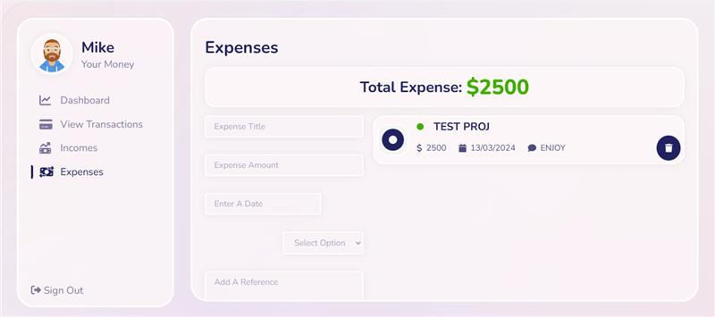

## 📌 Overview

The Expense Tracker is a full-stack financial tracking web application designed to help users **manage income, track expenses**, and **visualize spending patterns** in real-time. Built with the **MERN stack**, this project showcases practical use of **React hooks**, **Context API**, **RESTful backend**, and **MongoDB for persistence**.

This project is a solid demonstration of building and deploying a modern, scalable, and production-ready web application from end to end.

**Status:** 🚀 Deployed & Fully Functional  
**Tech Stack:** React · Node.js · Express.js · MongoDB · REST APIs

**Demo**
.jpeg)
.jpeg)

## ✨ Features

### ✅ Core Functionality
- ➕ **Add Transactions**: Record incomes or expenses with descriptions and amounts.
- 🧾 **Transaction History**: View a clean list of your financial transactions.
- 📊 **Real-Time Balance**: Automatically calculates and updates your current balance.
- 🗑️ **Delete Entries**: Remove any transaction with one click.
- 🔐 **Data Persistence**: All transactions are saved to MongoDB for long-term access.

### ⚙️ Technical Highlights
- ⚛️ **React 18**: Functional components and hooks-based architecture.
- 📦 **Context API**: Efficient state management for global data flow.
- 📡 **RESTful API**: Built with Express, following MVC design pattern.
- 🌐 **MongoDB Atlas**: Cloud-hosted NoSQL database with Mongoose ORM.
- 💅 **Material UI / Custom CSS**: Responsive, modern UI with clean UX.
- 🌍 **Deployed to Netlify** (frontend) & ready for backend deployment to Render/Heroku.

